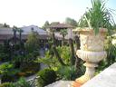
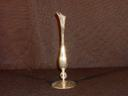
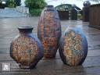
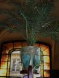
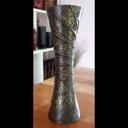
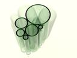
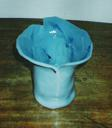
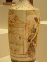
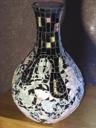
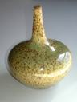

# Dirbtinio Intelekto Sistemos - Antras labaratorinis darbas

## Užduotis

Išmokti taikyti apmokytus kompiuterinės regos modelius ir įvertinti jų veikimą.

## Rezultatai

Rezultatai pateikti žemiau. Atpažinimui buvo naudojami 4 modeliai: ResNet18, ResNet152, ViT(timm) ir VGG19. 
Geriausias rezultatas pasiektas su Vision Transformer (ViT) modeliu - 60% tikslumas. Aukštesnio tikslumo tikėjausi pasiekti su VGG19 modeliu, nes jis turėtų geriau veikti su kompleksiškesnėmis nuotraukomis.

Reikėtų atkreipti dėmesį, kad kai kurios nuotraukos yra labai sunkiai atpažįstamos net žmogui (pvz. ILSVRC2012_val_00002092_n04522168.jpg).
Taip pat nuotraukos yra santykinai mažos raiškos, turi skirtingą apšvietimą, fotografavimo kampą ir foną.

**************************************************
> VGG19 modelio rezultatai: 
> Teisingai nustatytos klasės:  22 
> Neteisingai nustatytos klasės:  28 
> Tikslumas:  44.0 %
**************************************************
> ViT(timm) modelio rezultatai: 
> Teisingai nustatytos klasės:  30 
> Neteisingai nustatytos klasės:  20 
> Tikslumas:  60.0 %
**************************************************
>  modelio rezultatai: 
> Teisingai nustatytos klasės:  25 
> Neteisingai nustatytos klasės:  25 
> Tikslumas:  50.0 %
**************************************************
> ResNet18 modelio rezultatai: 
> Teisingai nustatytos klasės:  18 
> Neteisingai nustatytos klasės:  32 
> Tikslumas:  36.0 %
**************************************************

| Nuotraukos pavadinimas                | Nuotrauka                                                                                                        |ResNet18|ResNet152|ViT(timm)|VGG19|
|---------------------------------------|------------------------------------------------------------------------------------------------------------------|--------|---------|---------|-------|
| ILSVRC2012_val_00000895_n04522168.jpg |  |✅|✅|✅|❌|
| ILSVRC2012_val_00000973_n04522168.jpg |  |✅|✅|✅|✅|
| ILSVRC2012_val_00002092_n04522168.jpg |  |❌|❌|❌|❌|
| ILSVRC2012_val_00002873_n04522168.jpg |  |✅|✅|✅|✅|
| ILSVRC2012_val_00003657_n04522168.jpg |  |✅|✅|✅|✅|
| ILSVRC2012_val_00005485_n04522168.jpg |  |❌|❌|❌|❌|
| ILSVRC2012_val_00006280_n04522168.jpg |  |❌|✅|✅|❌|
| ILSVRC2012_val_00006712_n04522168.jpg |  |❌|❌|❌|❌|
| ILSVRC2012_val_00007642_n04522168.jpg |  |❌|❌|❌|❌|
| ILSVRC2012_val_00007772_n04522168.jpg |  |❌|❌|✅|❌|
| ILSVRC2012_val_00010407_n04522168.jpg |  |❌|❌|✅|❌|
| ILSVRC2012_val_00011020_n04522168.jpg |  |❌|❌|❌|❌|
| ILSVRC2012_val_00011121_n04522168.jpg |  |✅|✅|✅|✅|
| ILSVRC2012_val_00011908_n04522168.jpg |  |✅|✅|✅|❌|
| ILSVRC2012_val_00012036_n04522168.jpg |  |❌|✅|✅|❌|
| ILSVRC2012_val_00012147_n04522168.jpg |  |❌|❌|✅|❌|
| ILSVRC2012_val_00013199_n04522168.jpg |  |❌|❌|❌|❌|
| ILSVRC2012_val_00017607_n04522168.jpg |  |✅|✅|❌|✅|
| ILSVRC2012_val_00018049_n04522168.jpg |  |❌|❌|❌|✅|
| ILSVRC2012_val_00018077_n04522168.jpg |  |✅|✅|✅|❌|
| ILSVRC2012_val_00018777_n04522168.jpg |  |❌|❌|❌|❌|
| ILSVRC2012_val_00018977_n04522168.jpg |  |❌|✅|✅|✅|
| ILSVRC2012_val_00028768_n04522168.jpg |  |❌|❌|❌|❌|
| ILSVRC2012_val_00030856_n04522168.jpg |  |❌|❌|❌|❌|
| ILSVRC2012_val_00031441_n04522168.jpg |  |✅|✅|✅|✅|
| ILSVRC2012_val_00031592_n04522168.jpg |  |✅|✅|✅|✅|
| ILSVRC2012_val_00031654_n04522168.jpg |  |✅|❌|✅|✅|
| ILSVRC2012_val_00031872_n04522168.jpg |  |✅|✅|✅|✅|
| ILSVRC2012_val_00032364_n04522168.jpg |  |✅|✅|✅|✅|
| ILSVRC2012_val_00034163_n04522168.jpg |  |❌|✅|✅|✅|
| ILSVRC2012_val_00034387_n04522168.jpg |  |❌|✅|✅|✅|
| ILSVRC2012_val_00035219_n04522168.jpg |  |❌|❌|❌|❌|
| ILSVRC2012_val_00035813_n04522168.jpg |  |❌|✅|✅|✅|
| ILSVRC2012_val_00037121_n04522168.jpg |  |❌|❌|❌|❌|
| ILSVRC2012_val_00037335_n04522168.jpg |  |✅|✅|✅|✅|
| ILSVRC2012_val_00039280_n04522168.jpg |  |❌|❌|✅|❌|
| ILSVRC2012_val_00039729_n04522168.jpg |  |✅|✅|❌|✅|
| ILSVRC2012_val_00040024_n04522168.jpg |  |❌|❌|✅|❌|
| ILSVRC2012_val_00041967_n04522168.jpg |  |❌|❌|❌|❌|
| ILSVRC2012_val_00042916_n04522168.jpg |  |❌|❌|❌|❌|
| ILSVRC2012_val_00042947_n04522168.jpg |  |❌|❌|❌|❌|
| ILSVRC2012_val_00045714_n04522168.jpg |  |✅|✅|✅|✅|
| ILSVRC2012_val_00046271_n04522168.jpg |  |❌|❌|❌|❌|
| ILSVRC2012_val_00046900_n04522168.jpg |  |❌|❌|✅|❌|
| ILSVRC2012_val_00047178_n04522168.jpg |  |❌|❌|❌|✅|
| ILSVRC2012_val_00047639_n04522168.jpg |  |✅|✅|✅|✅|
| ILSVRC2012_val_00047813_n04522168.jpg |  |❌|❌|❌|❌|
| ILSVRC2012_val_00048073_n04522168.jpg |  |✅|✅|✅|✅|
| ILSVRC2012_val_00048744_n04522168.jpg |  |❌|✅|✅|✅|
| ILSVRC2012_val_00049753_n04522168.jpg |  |❌|✅|✅|❌|