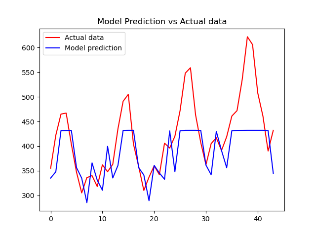
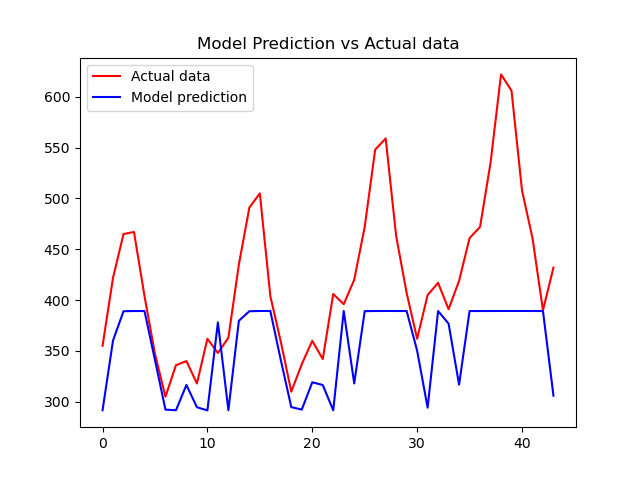
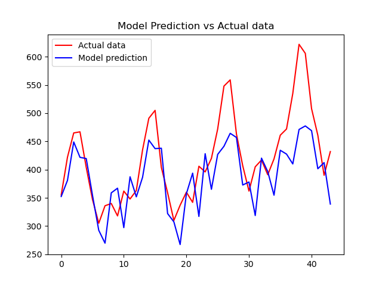
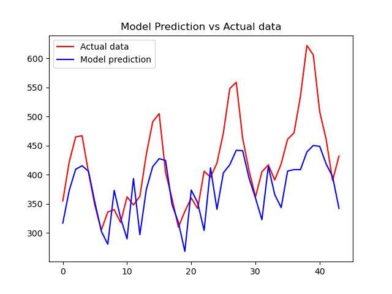
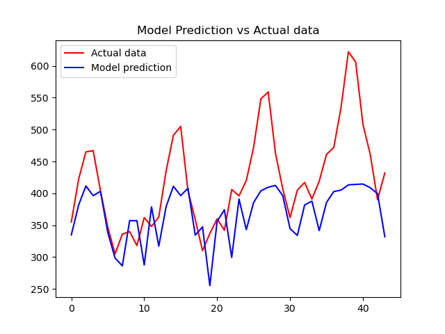
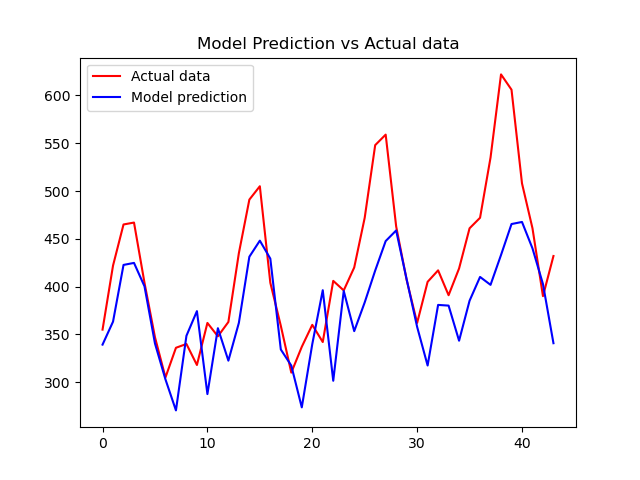
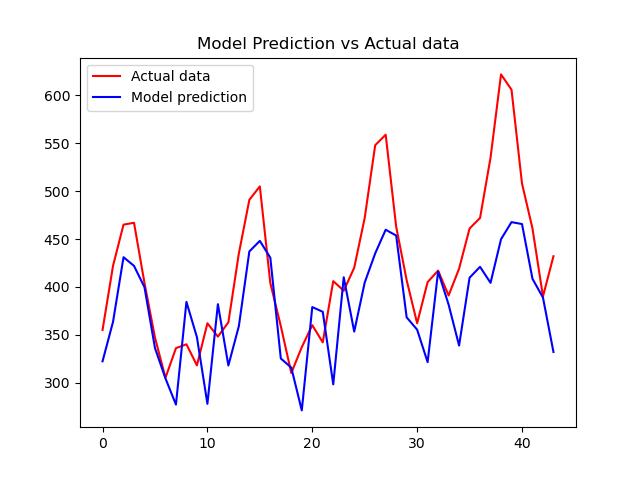
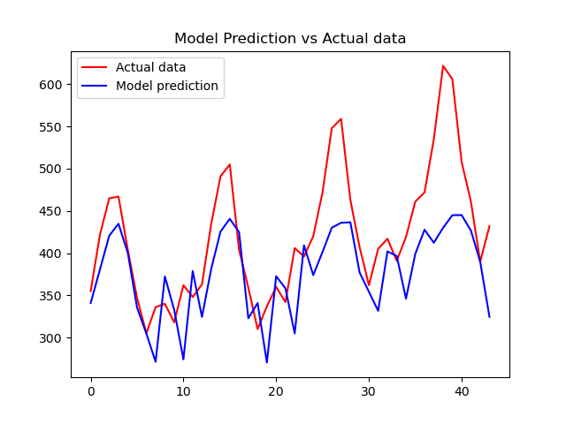
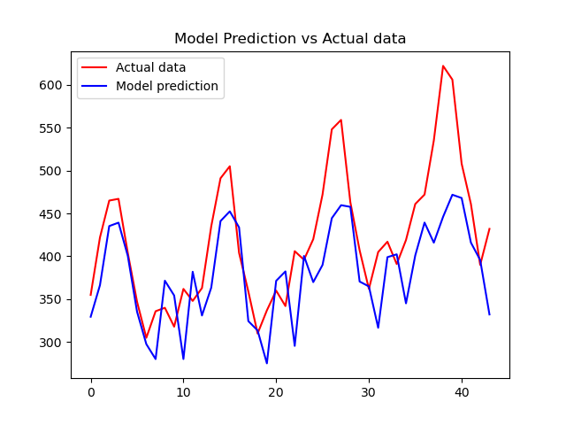

# Dirbtinio Intelekto Sistemos - Trečias labaratorinis darbas

## Užduotis

Pasirinkti neuroninio tinklo hiperparametrus, su kuriais gaunami geriausi prognozavimo 
rezultatai.

## Rezultatai

Rezultatai pateikti lentelėje žemiau:

| Batch size | Hidden size | Layers | Learning rate | Epochs | RMSE     | Overfitting | Nuotrauka                                                 |
|------------|-------------|--------|---------------|--------|----------|-------------|-----------------------------------------------------------|
| 8          | 32          | 1      | 0.005         | 5000   | 83.3720  | 🟩           |           |
| 8          | 32          | 1      | 0.01          | 5000   | 98.2982  | 🟩           |            |
| 8          | 32          | 1      | 0.001         | 5000   | 68.6533  | 🟩           |           |
| 8          | 32          | 1      | 0.0005        | 5000   | 69.5454  | 🟩           |         |
| 16         | 32          | 1      | 0.001         | 5000   | 79.3787  | 🟩           |          |
| 8          | 32          | 2      | 0.001         | 5000   | 82.3342  | 🟥           |        |
| 8          | 64          | 1      | 0.001         | 5000   | 68.0320  | 🟥           |   |
| 8          | 128         | 1      | 0.001         | 3000   | 68.4474  | 🟥           |  |
| 8          | 256         | 1      | 0.001         | 3000   | 70.3084  | 🟥           |  |
| 8          | 128         | 1      | 0.001         | 2000   | 64.9055  | 🟩           |  |

Kaip matome iš rezultatų lentelės, tikslias prognozes (mažiausia RMSE (vidutinės kvadratinės paklaidos) reikšmė) pavyko pasiekti su sekančiais hipermarametrais:
> Batch size: 8 
> Hidden size:  128 
> Layers:  1 
> Learning rate:  0.001 
> Epochs:  2000 

## Išvados

Pateikta rezultatų lentelė suteikia įžvalgų apie tai, kaip įvairūs hiperparametrai veikia LSTM neuroninio tinklo modelio tikslumą laikinių sekų prognozavimo užduotyje. Pagrindinės išvados yra šios:

Eksperimentuojant pavyko nustatyti tokias priklausomybes:
* Batch size - neturėjo didelės įtakos, nes duomenų masyvas santykinai mažas ir mokymosi laikas nebuvo iššūkiu.
* Hidden size - turėjo nemažai įtakos modeliui. Bandžiau didinti paslėptų sluoksnių dydį, tam kad modelis geriau "pagautų" staigius sekų pokyčius.
* Number of layers - stipriai blogino modelio RMSE, nesu tikras kodėl, greičiausiai dėl mažo duomenų kiekio.
* Learning rate - neturėjo didelės įtakos, nes resursai buvo pakankami, mokymasis vyko greitai ir duomenų buvo mažai. Jeigų būtų daugiau laiko, būtų įdomu pažiūrėti kaip keičiasi modelio RMSE keičiant optimizavimo algoritmus (dabar buvo naudojamas Adam).
* Number of epochs - turėjo įtaka, nes mokymasis nebuvo stabdomas (nebent žmogaus), kai atsirasdavo overfitting'as.

Šios išvados pabrėžia hiperparametrų derinimo svarbą siekiant optimalaus modelio tiksulmo. 

Kadangi naudotas Python kodas buvo ne mano, tai jį į GitHub nekeliau ir pateikiau tik MS Teams įkeltame ZIP archive (kodas beveik nemodifikuotas).