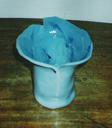

# Dirbtinio Intelekto Sistemos - Ketvirtas labaratorinis darbas

## Užduotis

Interneto svetainėse, kuriose pateikiami ar pristatomi apmokyti modeliai, pasirinkti modelį ir 
jį išanalizuoti.

## Darbo eiga
Iš svetainių: https://huggingface.co, https://paperswithcode.com ar kitų pasirinkti 
meuroninių tinklų modelį. Išbandykite jį interneto svetainėje (https://huggingface.co/spaces), Google 
Colab aplinkoje ar savo kompiuteryje.
Aprašykite panaudotą neuroninio tinklo architektūrą.
Aptarkite tokio neuroninio tinklo mokymą.

## Darbo aprašymas, rezultatai ir išvados

Darbe nagrinėjami 2 modeliai. Pirmas modelis - Neuroninio tinklo architektūros aprašymą (https://huggingface.co/google/vit-base-patch16-224),
vienas iš populiariausių Hugging Face modelių objektų atpažinimui paveikslėliuose. Kitas modelis - AWS Rekognition - SaaS principu teikiama paslauga,
skirta objektų atpažinimui (ne vien tik, bet šiame darbe buvo naudojamas tik objektų atpažinimo funkcionalumas - https://docs.aws.amazon.com/rekognition/latest/dg/what-is.html). 

Modelių rezultatai (naudojami 2-ojo laboratorinio  darbo duomenų rinkiniai, tam kad rezultatus būtų galima palyginti ir su kitais modeliais):

**************************************************
> google/vit-base-patch16-224 modelio rezultatai:  
> Teisingai nustatytos klasės:  32 
> Neteisingai nustatytos klasės:  18 
> Tikslumas:  64.0 % 
**************************************************
> AWS Rekognition rezultatai: 
> Teisingai nustatytos klasės:  42 
> Neteisingai nustatytos klasės:  8 
> Tikslumas:  84.0 % 
**************************************************

|Nuotraukos pavadinimas  |Nuotrauka| google/vit-base-patch16-224 rezultatas | google/vit-base-patch16-224 raktažodžiai | aws-rekognition rezultatas |aws-rekognition raktažodžiai|
|-------------------------------------|----------------------------------------------------------------------------------------------------------------|----------------------------------------|------------------------------------------|----------------------------|----------------------------|
|ILSVRC2012_val_00000895_n04522168.jpg|| ✅                                      | vase                                     | ✅                          |('vase', 100.0)|
|ILSVRC2012_val_00000973_n04522168.jpg|| ✅                                      | vase                                     | ✅                          |('vase', 99.99966430664062)|
|ILSVRC2012_val_00002092_n04522168.jpg|| ❌                                      | wool, woolen, woollen                    | ❌                          |N/A|
|ILSVRC2012_val_00002873_n04522168.jpg|| ✅                                      | vase                                     | ✅                          |('vase', 99.82991790771484)|
|ILSVRC2012_val_00003657_n04522168.jpg|| ✅                                      | vase                                     | ✅                          |('vase', 99.79991149902344)|
|ILSVRC2012_val_00005485_n04522168.jpg|| ❌                                      | pot, flowerpot                           | ✅                          |('vase', 97.58038330078125)|
|ILSVRC2012_val_00006280_n04522168.jpg|| ✅                                      | vase                                     | ❌                          |N/A|
|ILSVRC2012_val_00006712_n04522168.jpg|| ❌                                      | pot, flowerpot                           | ✅                          |('vase', 98.76490020751953)|
|ILSVRC2012_val_00007642_n04522168.jpg|| ❌                                      | goblet                                   | ✅                          |('vase', 56.6879997253418)|
|ILSVRC2012_val_00007772_n04522168.jpg|| ❌                                      | cup                                      | ✅                          |('vase', 57.993804931640625)|
|ILSVRC2012_val_00010407_n04522168.jpg|| ✅                                      | vase                                     | ✅                          |('vase', 81.72957611083984)|
|ILSVRC2012_val_00011020_n04522168.jpg|| ❌                                      | chest                                    | ❌                          |N/A|
|ILSVRC2012_val_00011121_n04522168.jpg|| ✅                                      | vase                                     | ✅                          |('vase', 100.0)|
|ILSVRC2012_val_00011908_n04522168.jpg|| ✅                                      | vase                                     | ✅                          |('vase', 99.99910736083984)|
|ILSVRC2012_val_00012036_n04522168.jpg|| ✅                                      | vase                                     | ✅                          |('vase', 55.54593276977539)|
|ILSVRC2012_val_00012147_n04522168.jpg|| ✅                                      | vase                                     | ✅                          |('vase', 99.99995422363281)|
|ILSVRC2012_val_00013199_n04522168.jpg|| ✅                                      | vase                                     | ✅                          |('vase', 99.994384765625)|
|ILSVRC2012_val_00017607_n04522168.jpg|| ✅                                      | vase                                     | ✅                          |('vase', 99.99279022216797)|
|ILSVRC2012_val_00018049_n04522168.jpg|| ❌                                      | pitcher, ewer                            | ✅                          |('vase', 60.483699798583984)|
|ILSVRC2012_val_00018077_n04522168.jpg|| ✅                                      | vase                                     | ✅                          |('vase', 99.99777221679688)|
|ILSVRC2012_val_00018777_n04522168.jpg|| ❌                                      | altar                                    | ✅                          |('vase', 96.28599548339844)|
|ILSVRC2012_val_00018977_n04522168.jpg|| ✅                                      | vase                                     | ✅                          |('vase', 57.7679557800293)|
|ILSVRC2012_val_00028768_n04522168.jpg|| ✅                                      | vase                                     | ✅                          |('vase', 99.99870300292969)|
|ILSVRC2012_val_00030856_n04522168.jpg|| ❌                                      | china cabinet, china closet              | ❌                          |N/A|
|ILSVRC2012_val_00031441_n04522168.jpg|| ✅                                      | vase                                     | ✅                          |('vase', 99.99853515625)|
|ILSVRC2012_val_00031592_n04522168.jpg|| ✅                                      | vase                                     | ✅                          |('vase', 99.99868774414062)|
|ILSVRC2012_val_00031654_n04522168.jpg|| ✅                                      | vase                                     | ✅                          |('vase', 99.99987030029297)|
|ILSVRC2012_val_00031872_n04522168.jpg|| ✅                                      | vase                                     | ✅                          |('vase', 99.97517395019531)|
|ILSVRC2012_val_00032364_n04522168.jpg|| ✅                                      | vase                                     | ✅                          |('vase', 99.9999771118164)|
|ILSVRC2012_val_00034163_n04522168.jpg|| ✅                                      | vase                                     | ❌                          |N/A|
|ILSVRC2012_val_00034387_n04522168.jpg|| ✅                                      | vase                                     | ✅                          |('vase', 57.30106735229492)|
|ILSVRC2012_val_00035219_n04522168.jpg|| ❌                                      | hoopskirt, crinoline                     | ❌                          |N/A|
|ILSVRC2012_val_00035813_n04522168.jpg|| ✅                                      | vase                                     | ✅                          |('vase', 100.0)|
|ILSVRC2012_val_00037121_n04522168.jpg|| ✅                                      | vase                                     | ✅                          |('vase', 99.58926391601562)|
|ILSVRC2012_val_00037335_n04522168.jpg|| ✅                                      | vase                                     | ✅                          |('vase', 89.26667785644531)|
|ILSVRC2012_val_00039280_n04522168.jpg|| ❌                                      | plate rack                               | ✅                          |('vase', 56.30037307739258)|
|ILSVRC2012_val_00039729_n04522168.jpg|| ✅                                      | vase                                     | ✅                          |('vase', 99.99970245361328)|
|ILSVRC2012_val_00040024_n04522168.jpg|| ❌                                      | velvet                                   | ✅                          |('vase', 57.41051483154297)|
|ILSVRC2012_val_00041967_n04522168.jpg|| ❌                                      | pot, flowerpot                           | ✅                          |('vase', 57.12358474731445)|
|ILSVRC2012_val_00042916_n04522168.jpg|| ❌                                      | candle, taper, wax light                 | ✅                          |('vase', 79.41299438476562)|
|ILSVRC2012_val_00042947_n04522168.jpg|| ✅                                      | vase                                     | ✅                          |('vase', 99.99668884277344)|
|ILSVRC2012_val_00045714_n04522168.jpg|| ✅                                      | vase                                     | ✅                          |('vase', 99.98002624511719)|
|ILSVRC2012_val_00046271_n04522168.jpg|| ✅                                      | vase                                     | ❌                          |N/A|
|ILSVRC2012_val_00046900_n04522168.jpg|| ❌                                      | pot, flowerpot                           | ✅                          |('vase', 99.99968719482422)|
|ILSVRC2012_val_00047178_n04522168.jpg|| ❌                                      | hook, claw                               | ✅                          |('vase', 57.387264251708984)|
|ILSVRC2012_val_00047639_n04522168.jpg|| ✅                                      | vase                                     | ✅                          |('vase', 99.99929809570312)|
|ILSVRC2012_val_00047813_n04522168.jpg|| ❌                                      | pedestal, plinth, footstall              | ✅                          |('vase', 99.91345977783203)|
|ILSVRC2012_val_00048073_n04522168.jpg|| ✅                                      | vase                                     | ❌                          |N/A|
|ILSVRC2012_val_00048744_n04522168.jpg|| ❌                                      | whiskey jug                              | ✅                          |('vase', 99.99998474121094)|
|ILSVRC2012_val_00049753_n04522168.jpg|| ✅                                      | vase                                     | ✅                          |('vase', 99.99758911132812)|

**************************************************

### Neuroninio tinklų architektūrų aprašymai:

**google/vit-base-patch16-224**
    
    Tipas: Vision Transformer (ViT).
    Sluoksniai: susideda iš transformerių, kurie dažniausiai naudojami natūralios kalbos atpažinimui, tačiau šiuo atveju pasirodo efektyvus ir vaizdų atpažinime.
    Įvestis: 224x224 dydžio paveikslėlis, padalintas į 16x16 pikselių dydžio lopus (patches), kurie vėliau konvertuojami į 1D token'us.
    Ypatumai:
        Naudojamas Multi-Head Self-Attention mechanizmas (nesu tikras dėl vertimo) - leidžia geriau "pamatyti" skirtingas detales.
        Standartiniai sprendimai:
            Naudojamas daugiasluoksnis  perceptronas
            Klasifikavimo sluoksnis - tipinis FFNN sluoksnis klasifikavimo uždaviniams.

**AWS Rekognition**

    Tipas: neatskleidžiama, tačiau manoma kad greičiausiai tai yra giliai besimokantis (deep learning) konvoliucinis neuroninis tinklas (CNN).
    Sluoksniai: neatskleidžiami, uždaro kodo AWS sprendimas
    Įvestis: neatskleidžiamas, uždaro kodo AWS sprendimas, iš vartotojo pusės priimami JPEG formato paveikslėliai.
    Ypatumai:
        Nežinomi, uždaro kodo AWS sprendimas - dokumentacijoje ir viešai prieinamoje medžiagoje techniniai ypatumai neaprašyti.

### Neuroninio tinklų mokymas

Šiame darbe analizuojami neuroniniai modeliai jau apmokyti (pvz. google/vit-base-patch16-224 apmokytas (prižiūrimas mokymasis), naudojant ImageNet-21k biblioteką, bei papildomai tobulinamas naudojant ImageNet ILSVRC2012 rinkinį ir klases).

Amazon Rekognition atveju mokymui naudojamas duomenų rinkinys nėra atskleidžiamas, taipogi naudojamos klasės nėra standartizuotos (bet preliminariai atitinka  ImageNet klasėms).

google/vit-base-patch16-224 atveju, modelis galėtų būti papildomai apmokamas. Amazon Rekognition atveju papildomas apmokymas yra irgi galimas, tačiau tik iš dalies, apmokant modelį
atpažinti naujas klases - tam būtų naudojamas Amazon Rekognition Custom Labels funkcionalumas. Norint papildomai apmokyti modelį dirbti su egzistuojančiomis klasėmis, reikėtų naudoti
kitus AWS services, tokius kaip pvz. SageMaker.

Papildomai apmokant vit-base-patch16-224 modelį, reikėtų paruoštų 224x224 dydžio paruoštų paveikslėlių. Papildomai apmokant tinklą galima parinkti hiperparametrus. 
Taip pat dokumentacijoje rekomenduojama "užšaldyti" pirmų sluoksnių svorius papildomo apmokymo metu.
Pagal nutylėjimą naudojamas Cross-Entropy Loss nuostolių funkciją (geriausiai tinkanti klasifikavimo uždaviniams), tačiau galima naudoti ir kitas.

### Išvados

Darbo eigoje buvo nustatyta kad didesnis tikslumas  (84%) buvo pasiektas naudojant Amazon Rekognition paslauga ir jų uždaru (proprietary) modeliu. 
Tiesioginis palyginimas tarp nagrinėjamų modelių yra neįmanomas, kadangi viešų duomenų apie Amazon Rekognition naudojamą modelį nėra. 
Naudojant paprastiems, mažos apimties objektų atpažinimo uždaviniams, nereikalaujantiems papildomo apmokymo Amazon Rekognition modelis atrodo patraukliau.
Tačiau, reikėtų įskaičiuoti ir papildomus kaštus - tokio modelio naudojimas objektų atpažinimui panašaus duomenų rinkiniui kainuotų ~ 0.05 USD.
Jau apmokytas google/vit-base-patch16-224 modelis taip pat parodė aukštą tikslumą (64%), bei suteikia daugiau galimybių pritaikymui esant labiau specifiniams reikalavimams.

